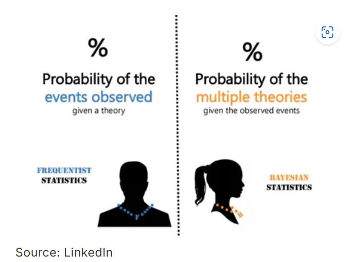
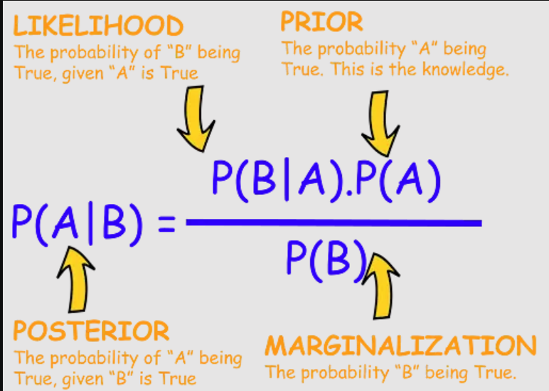
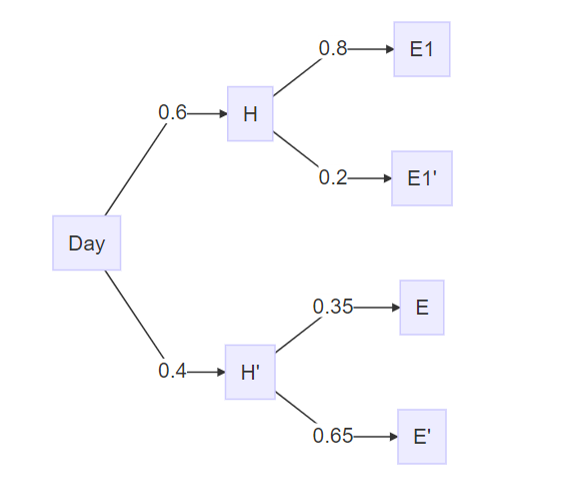

```{r setup, comment = NA, include=FALSE}
knitr::opts_chunk$set(echo = TRUE)
```

\pagenumbering{gobble}

\pagecolor{pink}
\begin{centering}

\Large

{\bf Bayesian Statistics: A basic understanding using R }

\end{centering}


\begin{centering}

\Large

{\bf Prakash Lamichhane }


Ecologist / Data Analyst / Research Officer

Ministry of Forests and Environment

Nepal

\end{centering}

\newpage

\pagecolor{white}

\pagenumbering{roman}

\tableofcontents

\newpage

\listoftables

\newpage

\listoffigures

\newpage

\pagenumbering{arabic}

# Introduction

Bayesian statistics is an approach to probability that allows us to update our beliefs about random events as new data or evidence becomes available. In Bayesian inference, probability is viewed as a measure of how strongly we believe an event will occur, rather than just the likelihood of it happening.

We start with a prior belief about an event, but as new evidence comes in, this belief may change. Bayesian statistics offers a mathematical framework for combining our prior beliefs with new evidence to form updated, or posterior, beliefs.

This method contrasts with frequentist statistics, which interprets probability as the frequency of an event occurring over repeated trials. For example, if you repeatedly roll a fair six-sided die, each number should come up about 1/6 of the time. Frequentist statistics relies on the long-run frequency of outcomes in these repeated trials.

When it comes to statistical inference, or drawing conclusions from data, Bayesian and frequentist approaches differ significantly in philosophy. Frequentist statistics aims to provide estimates that minimize uncertainty, while Bayesian statistics seeks to preserve and refine uncertainty by continuously updating beliefs as new information is obtained.

## Overview of Frequentist vs. Bayesian Approaches

(Taken from [here](https://www.quantstart.com/articles/Bayesian-Statistics-A-Beginners-Guide/))

In order to make clear the distinction between the two differing statistical philosophies, we will consider following examples of probabilistic systems:



\newpage

- **Coin Flips** : What is the probability of an unfair coin coming up heads?

- **Prime Minister** : What is the probability of seeing an individual candidate winning, who has not stood before?

The following table describes the alternative philosophies of the frequentist and Bayesian approaches.

|Example|Frequentist Interpretation|Bayesian Interpretation|
|-|---|---|
|Unfair Coin Flip|The probability of seeing a head when the unfair coin is flipped is the long-run relative frequency of seeing a head when repeated flips of the coin are carried out. That is, as we carry out more coin flips the number of heads obtained as a proportion of the total flips tends to the "true" or "physical" probability of the coin coming up as heads. In particular the individual running the experiment does not incorporate their own beliefs about the fairness of other coins.|Prior to any flips of the coin an individual may believe that the coin is fair. After a few flips the coin continually comes up heads. Thus the prior belief about fairness of the coin is modified to account for the fact that three heads have come up in a row and thus the coin might not be fair. After 500 flips, with 400 heads, the individual believes that the coin is very unlikely to be fair. The posterior belief is heavily modified from the prior belief of a fair coin.|
||||
|Election of Candidate|The candidate only ever stands once for this particular election and so we cannot perform "repeated trials". In a frequentist setting we construct "virtual" trials of the election process. The probability of the candidate winning is defined as the relative frequency of the candidate winning in the "virtual" trials as a fraction of all trials.|An individual has a prior belief of a candidate's chances of winning an election and their confidence can be quantified as a probability. However another individual could also have a separate differing prior belief about the same candidate's chances. As new data arrives, both beliefs are (rationally) updated by the Bayesian procedure.|

: Different approach of thinking the result

Here is an another example which makes Bayesian statistics more understandable to audience.

**Scenario:**

Suppose a medical test is developed to detect a rare diseases that affects 1 in 1,000 people. The test is known to be 99 % accurate, meaning it correctly identifies 99 % of those who have the disease (true positive) and correctly identifies 99 % of those who do not have the disease (true negatives). You take the test and receive a positive result. What is the probability that you actually have the diseases ?

|**Frequentist Interpretation:**|**Bayesian Interpretation**|
|-|-|
|In the frequentist approach, you would rely on the test's accuracy and the overall rate of the disease in the population. You would conduct repeated tests on many people, and calculate the frequency of positive results among those who actually have the disease. The probability is interpreted as the long-run frequency of this outcome in repeated trials.|In the Bayesian approach, you would start with a prior belief about the likelihood of having the disease based on its prevalence (1 in 1,000 or 0.1%). Then, you would update this belief based on the positive test result using Bayes' theorem.|
|||
|In this case, the frequentist would note that the disease is rare, and although the test is highly accurate, the low prevalence of the disease means that many positive results are likely to be false positives. The frequentist interpretation is less focused on updating beliefs based on the specific outcome of your test and more on the overall accuracy and prevalence data.| Your prior belief (low probability of having the disease) would be combined with the likelihood of getting a positive test result if you had the disease, and the likelihood of a positive test result if you didn't have the disease. The result is a posterior probability that takes into account both the initial low prevalence and the test's accuracy. This updated belief (posterior probability) might still be low, given the rarity of the disease, despite the positive test.|
|||
|Focuses on the long-run frequency of outcomes and uses the overall accuracy and prevalence without directly incorporating prior beliefs.|Starts with a prior belief based on the disease's prevalence and updates this belief based on the test result, leading to a new, refined probability.|

: Clarification on focuses by frequentists and Bayesians


This example highlights how Bayesian statistics allows you to refine your understanding based on new evidence, while frequentist statistics focuses on frequencies and probabilities observed in repeated trials or large samples.

## History and Philosphy of Bayesian Statistics

**History of Bayesian Statistics**

1. Thomas Bayes (1701-1761):

- The origin of Bayesian statistics is attributed to Reverend Thomas Bayes, an English statistician and Presbyterian minister.

- Bayes developed a theorem (now known as Bayes' Theorem) that provided a method for updating the probability of a hypothesis based on new evidence.

- Bayes' work was published posthumously in 1763 by Richard Price.

2. Pierre -Simon Laplace (1749-1827):

- The French mathematician Laplace independently developed and expanded upon Bayes' ideas in the late 18th and early 19th centuries.

- Laplace applied Bayesian methods to a wide range of problems, from astronomy to legal reasoning.

- He formulated the principle of inverse probability, which is central to Bayesian reasoning.

3. Development and Controversy:

- Bayesian methods were largely overshadowed by frequentist approaches (developed by R.A. Fisher, Jerzy Neyman, and Egon Pearson) during the 20th century.

- Frequentist methods dominated the field of statistics due to their computational simplicity and philosophical appeal to the scientific community at the time.

- However, Bayesian methods experienced a resurgence in the latter half of the 20th century, particularly with the advent of modern computing, which made Bayesian computations more feasible.

4. Modern Bayesian Statistics:

- Today, Bayesian statistics is widely used in various fields such as machine learning, epidemiology, economics, and environmental science.

- The Bayesian approach allows for incorporating prior knowledge and updating beliefs in light of new data, making it powerful for sequential data analysis and decision-making under uncertainty.


**Philosophy of Bayesian Statistics**

1. **Subjective Probability:**

- Bayesian probability is often interpreted subjectively, where probabilities represent degress of belief or confidence in a particular hypothesis, rather than objective frequencies.

- This contrasts with the frequentist interpretation, where probability is understood as the long-run frequency of events.




2. **Bayesian Inference:**

- Bayesian inference involves updating prior beliefs in light of new evidence to produce a posterior distribution.

- The prior distribution reflects what is known before observing the data, and the likelihood reflects the evidence provided by the data.

- This process embodies a learning mechanism, where beliefs are updated continuously as new information becomes available.

3. **Debate with frequentism:**

- The philosophical debate between Bayesian and frequentist approaches centers around the interpretation of probability and the role of prior information.

- Frequentists argue for the objectivity of their methods, avoiding the subjectivity of choosing priors, while Bayesians emphasize the flexibility and coherence of their approach.

*Note: "Bayesian Data Analysis" by Andrew Gelman et al.: This book provides a comprehensive introduction to Bayesian statistics, including its philosophical foundations.* 

## Basic Terminology and Concepts

Here’s an explanation of some basic terminology and concepts in Bayesian statistics:

1. **Bayes' Theorem**

Bayes' Theorem is the foundation of Bayesian statistics. It describes how to update the probability of a hypothesis,$H$ given new evidence,$E$.

$$P(H|E) = \frac{P(E|H)\times P(H)}{P(E)} \tag{i}$$

Where:

- $P(H|E)$ is the **posterior probability**, or the probability of the hypothesis after considering the evidence.

- $P(E|H)$ is the **likelihood**, or the probability of the observing evidence given that the hypothesis is true.

- $P(H)$ is the **prior probability**, or the initial probability of the hypothesis before seeing the evidence.

- $P(E)$ is the **marginal likelihood or evidence**, which is the total probability of the evidence under all possible hypotheses.

2. **Prior Probability (prior)**

The prior probability,$P(H)$ represents your initial belief about the probability of a hypothesis before considering new data. It reflects any existing knowledge or assumptions.

3. **Likelihood**

The likelihood, $P(E|H)$ is the probability of observing the evidence assuming the hypothesis is true. It’s a measure of how well the hypothesis explains the observed data.

4. **Posterior Probability (Posterior)**

The posterior probability,$P(H|E)$is the updated probability of the hypothesis after considering the new evidence. It combines the prior probability and the likelihood to give a new, revised probability.

5. **Marginal Likelihood (Evidence)**

The marginal likelihood,$P(E)$ is the probability of observing the evidence under all possible hypotheses. It acts as a normalizing factor in Bayes’ Theorem to ensure the posterior probabilities sum to 1.

6. **Conjugate Prior**

A conjugate prior is a type of prior distribution that, when used in conjunction with a particular likelihood function, results in a posterior distribution that is in the same family as the prior distribution. This simplifies the computation of the posterior.

7. **Credible Interval**

A credible interval is the Bayesian equivalent of a confidence interval in frequentist statistics. It represents the range within which a parameter lies with a certain probability, given the observed data.

8. **Bayesian Inference**

Bayesian inference is the process of updating your beliefs about a parameter or hypothesis using Bayes' Theorem. It’s a framework for making probabilistic statements and decisions based on evidence.

9. **Markov Chain Monte Carlo (MCMC)**

MCMC is a computational technique used to approximate the posterior distribution when it cannot be computed analytically. It involves generating samples from the posterior distribution by constructing a Markov chain that has the desired distribution as its equilibrium distribution.

10. **Posterior Predictive Distribution**

The posterior predictive distribution is the distribution of possible future observations given the current data and the posterior distribution. It’s used for making predictions based on the model.

11. **Loss Function**

In decision theory, a loss function quantifies the cost of making a particular decision or prediction. Bayesian decision-making often involves minimizing expected loss, which is calculated using the posterior distribution.

12. **Prior Predictive Distribution**

The prior predictive distribution is the distribution of possible future observations based on the prior distribution before any data is observed. It helps to understand the implications of the prior.

13. **Hyperparameters**

Hyperparameters are parameters that define the prior distribution in hierarchical Bayesian models. They control the shape or scale of the prior distribution.

14. **Bayes Factor**

The Bayes factor is a ratio of the marginal likelihoods of two competing hypotheses. It’s used for hypothesis testing in the Bayesian framework, providing a measure of the evidence in favor of one hypothesis over another.

15. **Posterior Odds**

Posterior odds is the ratio of the posterior probabilities of two competing hypotheses. It’s used to compare the relative plausibility of the hypotheses after considering the evidence.

These concepts and terms are foundational to understanding Bayesian statistics and will be useful as you dive deeper into the subject.

\newpage

# Bayes' Theorem

Bayes' Theorem is a fundamental concept in probability theory and statistics, forming the basis of Bayesian statistics. It describes how to update the probability of a hypothesis (an event or parameter) based on new evidence. For mathematical expression and its components please refer equation(i).

## Derivation of Baby Bayes' Theorem

Bayes' Theorem is derived from the definition of conditional probability.

Given $A$ and $B$, Bayes' Theorem states:

$$P(A|B) = \frac{P(B|A)\times P(A)}{P(B)} \tag{i}$$

1. **Conditional Probability**:

- The conditional Probability of $A$ given $B$ is defined as:

$$P(A|B) = \frac{P(A \cap B )}{P(B)}$$

- Similarly, the conditional probability of $B$ given $A$ is:

$$P(B|A) = \frac{P(A\cap B)}{P(A)}$$

2. **Joint Probability**:

- The joint probability of $A$ and $B$ occuring together is the same regardless of the order:

$$P(A \cap B) = P(B \cap A)$$

3. **Rearrange to Get Baby Bayes' Theorem**:

- Substitute $P(A \cap B)$ from the second equation into first:

$$P(A|B) \times P(B) = P(B|A) * P(A)$$

- Solving for $P(A|B)$ gives:

$$P(A|B) = \frac{P(A \cap B )}{P(B)}$$


## Mathematical Example of Baby Bayes' Theorem

***Exampel 1***

***Suppose, Amira and Jane are sometimes late for school. 70 % of the time neither of them are late. Amira is late 20 % of the time while Jane is late 25 % of the time.***

***Last Monday Jane was late. Find the probability that Amira was Late.***

Lets solve this problem using baby bayes's theorem. Lets illustrate it in picture. 

```{r, echo=FALSE, message=FALSE, results='hide', fig.cap= "Illustration of the Mathematical Example in Venn diagram"}
# Load necessary package
pacman::p_load(VennDiagram)

# Create a Venn diagram with two circles
draw.pairwise.venn(
  area1 = 0.05 + 0.15,  # Area of circle A
  area2 = 0.1 + 0.15,   # Area of circle B
  cross.area = 0.15,    # Overlapping area (A and B)
  category = c("Amira", "Jane"),
  fill = c("lightblue", "pink"),
  alpha = 0.5,
  cat.pos = c(-20, 20),
  cat.dist = 0.05,
  ext.pos = 30,
  ext.dist = -0.2,
  ext.length = 0.85,
  ext.line.lwd = 2,
  ext.text = TRUE
)

# Draw a rectangle around the Venn diagram
grid.rect(width = unit(1, "npc") - unit(2, "mm"), 
          height = unit(1, "npc") - unit(2, "mm"), 
          gp = gpar(lwd = 2, col = "black"))

# Annotate the outside area but within the rectangle
grid.text("0.7", x = unit(0.5, "npc"), y = unit(0.1, "npc"))

```

Now, we can use the Baby Bayes' Theorem to solve the problem.


$$P(Amira | Jane) = \frac{P(Amira \cap Jane)}{P(Jane)}$$
Where,

$P(Amira | Jane) =$ Probability of Amira Being Late while Jane was Late.(Conditional Probability)

$P(Amira \cup Jane) =$ Probability of Amira and Jane both being late.(joint Probability)

$P(Jane) = $ Probability of Jane being late.

Lets, put the Numerical Value in it.


$$P(Amira | Jane) = \frac{0.15}{0.25} \sim 60 \space \%  $$

Lets simply the equation in terms of general conditions with hypothesis i.e., Amira being late to the evidence i.e., Jane was late. 

$$P(H|E) = \frac{P(H \cap E)}{P(E)} \tag{ii}$$

***Example 2***

***Tanya Loves to play tennis, but specially so when the whether is good. When it is sunny, the probability that she plays tennis is 80 %. When it is not sunny , the probability is just 35 %.***

***There is a 60 % percent chance that is sunny in any given day.***

***Last Sunday she Played tennis. What is the probability that it is sunny last Sunday?***

Here, we have many information like chance of being sunny day in any day, in sunny dayy she plays in 80 % case etc. and main thing is the evidence that she played tennis last sunday.


Now with this scenario lets set the hyposthesis that it was the sunny.

$H:$ The last Sunday is sunny.

$E:$ Tanya plays tennis last Sunday.

```{r echo = FALSE, fig.cap = "Probabilty tree of the mathematical problem 2.", fig.align='center', fig.height=6,fig.width=6, out.width= "60%"}
# Load necessary package
pacman::p_load(DiagrammeR,DiagrammeRsvg,rsvg)

d <- DiagrammeR("
   graph LR
   Day -->|0.6| H
    Day -->|0.4| H'
    H -->|0.8| E1
    H -->|0.2| E1'
    H' -->|0.35| E
    H' -->|0.65| E' 
")


```

From here we have to calculate the desired probability using this formula as shown in equation (ii).

With the help of the figure we can calculate:

$P(H \cap E) = 0.6 * 0.8  = 0.48$

$P(E) = 0.6 * 0.8 + 0.4 * 0.35 = 0.48 + 0.14 = 0.62$

Now, Putting that into the equation:

$$p(H|E) = \frac{P(H \cap E)}{P(E)} = \frac{0.48}{0.62} \sim 77 \%$$


## Conditional Probabilty with normal Distributions

Suppose the the normal distribution is expressed as $T \sim N(15.5,1.2^2)$ that means it is a normal distribution having mean of $15.5$ and standard deviation of $1.2$ around the mean value.

Describing the example: This is data from a ranges of students who completed the 100 meter run in 15.5 seconds at standard deviation of 1.2 seconds.

***Now the problem is finding the probability of a girl names Tina ***

```{r, echo = FALSE, fig.cap = "The normal distribution: the dark blue line showing the mean value and red line showing standard deviation from the mean then black vertical line is 13.5 seconds", fig.height=4, fig.width=6}
pacman::p_load(dplyr,ggplot2)
dat <- data.frame( value = rnorm(n = 10000, mean = 15.5, sd = 1.2))
dat %>%
  ggplot(mapping = (aes(x = value))) +
  geom_density(color = "black", fill = "lightblue") +
  geom_vline(aes(xintercept = mean(value)), color = "darkblue")+
  geom_vline(aes(xintercept = mean(value)-sd(value)), color = "red")+
  geom_vline(aes(xintercept = mean(value)+sd(value)), color = "red")+
  geom_vline(aes(xintercept = 13.5), color = "black",)+
  annotate(geom = "text", x = 12.2, y = 0.3, label = "T ~ N( 15.5 , 1.2^2)", size = 3.5) +
  theme_bw()
  
```

Now the problem is to find the probability of a girl finishing that 100 m run in 13.5 secs. In this case we do not know if girl can finish the race in the given time. With the help of normal distribution we ca calculate the percentage area left to the black line can be calculated using following formula:

$$Z_{Score} = \frac{X - \mu}{\sigma} = \frac{13.5 - 15.5}{1.2} = - 1.667$$

And, the percentage area left to the $13.5 \space sec$ is calculated using R or other computation method. Here I will do it using $pnrom()$ function  in R which is about 4.8 % as shown below.

```{r}
z_score <- (13.5 - 15.5) / 1.2
pnorm(z_score)
```

But another evidence is that the girl was selected in school running team and the criteria to be selected in school running team is that one has to complete the 100m race within 14 sec.So, the probability can be updated using this evidence.

```{r}
z_score <- (14 - 15.5) / 1.2
pnorm(z_score)
```

To do that we can use our Baby bayes' theorem.

$H: Sofia \space runs \space 100m \space in \space less \space than \space 13.5s$

$E: Sofia \space is \space in \space the \space school \space running \space team.$

$$P(H|E) = \frac{P(H \cap E)}{P(E)}$$

$$P(H|E) = \frac{P(T<13.5 \cap T<14)}{P(T<14)}$$

It is obvious that if she completes the race in 13.5s than that is also the case that she completed it in 14s. So,

$$P(H|E) = \frac{P(T<13.5)}{P(T<14)} = \frac{0.048}{0.106} \sim 45 \%$$

Hence, with the prior knowledge or evidence the probability is highly impacted and updated to 45 % from 4.8 % which is the magic of Bayesian statistics.

This is the basics of the Bayes' Theorem, Now looking at one of the famous example we can easily crack it down in depth.

***Suppose, a disease (X) affects 10 % of the people in a village. The tests say you have disease X. The accuracy of the test (T) is 80 %. In this case most people says that you have 80 % chance of having diseases. Lets try to confirm that if it is true.***

```{r, echo = FALSE, fig.cap="Illsutation of the example above. figure top left is the population, figure top right is the infected population (10 % in random), figure bottyom left arranged infected population to down row and figure bottom right is the demostrating population according to the tests accuracy.", out.width="50%",out.height="50%", fig.align='center'}

```

In the final figure, the people with color blue, yellow, red and green are healthy and tested as healthy, infected and tested as infected, healthy but testes as infected and unhealthy but testes as healthy respectively. That means the people with blue and yellow in color tested correctly whereas others are incorrectly told either they are healthy or infected.

Since you are told that you got infected you must be either from yellow group or from red group. So, the probability of you being infected is;

$$P(T|X) = \frac{8}{8+18} = \frac{8}{26} \sim 31 \%$$
Let's formalize this:

$$ yellow(8) = People \times P(X) * P(T|X) $$

$$ Red(18) = People \times P(X') * P(T|X') $$

Now;

$$\frac{People \times P(X) * P(T|X)}{People \times P(X) * P(T|X) + People \times P(X') * P(T|X')}$$

Let's remove the People from the formula:

$$\frac{P(X) * P(T|X)}{P(X) * P(T|X) +  P(X') * P(T|X')}$$

Rather than $X$ lets call $H$ as Hypothesis and instead of $T$ write it as $E$ as Evidence.

$$P(H|E) = \frac{P(H) * P(E|H)}{P(H) * P(E|H) +  P(H') * P(E|H')}$$

Write a way around;

$$P(H|E) = \frac{P(E|H) * P(H)}{P(E|H) * P(H) + P(E|H') * P(H')} \tag{This is called BAYES' THEOREM}$$

Hence, derived (HURRAH !).

## Solving Problem using Bayes Theorem.

Using this formula, lets solve a famous problem by Daniel Kahneman, in his book entitled "Thinking, Fast and Slow", a winner of the noble prize in economics.

***Problem: Steve is a very shy and withdrawn, invariable helpful but with very little interest in people or in the world of reality. A meek and tidy soul, he has a need for order and structure, and a passion for detail. What is the probability for steve being a librarian ?***

***Lets imagine a Steve's village has 110 people. 100 of them are farmers and remaining 10 are librarians which is an obvious trend as few proportion of any village will be librarian. Among them 30 % farmers are shy but 90 % of the librarians are shy as steve.***

In this example the proportion of Farmers : Librarians is 30:9 i.e., 77% : 23%. May be the general people say there is a 77 % chance that steve is librarian. Others also can say that 90 % of the librarian are shy so there is a 90 % chance that Steve is librarian.

Lets see what will be the chance that Steve being librarian using Bayesian theorem.

$H:$ Steve is a Librarian

$E:$ Evidence that Steve is shy.

$$P(H|E) = \frac{P(E|H) * P(H)}{P(E|H) * P(H) + P(E|H') * P(H')} \tag{This is called BAYES' THEOREM}$$

$$P(H|E) = \frac{\frac{9}{10} * \frac{10}{110}}{\frac{9}{10} * \frac{10}{110} + \frac{30}{100} * \frac{100}{110}} \sim 23 \%$$

Again another famous example:

Let's imagine Jane and Nikky are playing a game in which the rule is the player with fist six wins be the winner. Lets imagine they played first 8 set here is the result.

\begin{align*}
Jane = 5 sets \\
Nikky = 3 sets
\end{align*}

Now the question is what is the probability of Nikky winning the game. Here, the probability of Jane and Nikky winning next set is $\frac{5}{8}$ and $\frac{3}{8}$ respectively. So, frequentists can say the probability of Nikky winning the game is $(\frac{5}{8})^3 \sim 5.3 \%$ which is somehow correct. Imagine the probability of Nikky winning the single set is $x$ which means probability of Jane winning that set will be $1-x$. So with the evidence recorded;

$$x = P(N = 3, J = 5)$$

This can be calculated using binomial function using 8 choosing 3 and shown as follows:

$$\binom83 x^3 (1-x)^5 = 56 \space x^3 (1-x)^5 \tag{Binomial Function}$$
This can be applied using *choose()* function in R. Now if you draw the this normal distribution using this function that will return the figure below where we can see the highest probability of Nikky wins is around 5.3 % which seems quite logical.

```{r, echo=FALSE, out.width="100%", fig.align='center', fig.cap="Normal distribution curve of Binomial Function"}

```


Lets compute this probability using Bayesian theory. 

$H$ : Nikky wins the game

$E$ : $J = 5, N = 3$

Formalizing the case.

$$P(Nikky \space wins |J = 5, N = 3 ) = \frac{P(J = 5, N = 3 |Nikky \space wins) \space P(Nikky \space wins)}{P(J = 5,  N = 3)}$$

If you name the probability $P(J = 5,  N = 3)$, that will be $y = \binom83 x^3(1-x)^5$. But if you want know the sum of all possibility given that the value of $x$ that ranges from 0 to 1 and if you have gone through the calculus, then you know that in a continuous distribution, the sum of all possible results of infinitely many values can be calculated using integral of the binomial function above.

$$P(J = 5,  N = 3) = \int_0^1 \binom83x^3(1-x)^5dx \sim \frac{1}{9}$$

Note: in R you can calculate this using this code below:

```{r}
# Define the function to integrate
f <- function(x) {
  choose(8,3) * x^3 * (1 - x)^5
}

# Compute the integral from 0 to 1
result <- integrate(f, lower = 0, upper = 1)

# Print the result
paste0(result$value," Which is ~ 1/9")

```

Again, the function that calculates the $P(J = 5, N = 3 |Nikky \space wins) \space P(Nikky \space wins)$ will be;

$$y = \binom83 x^3(1-x)^5 * x^3 = \binom83 x^6(1-x)^5$$

Again using the calculus we can calculate:

$$P(J = 5, N = 3 |Nikky \space wins) \space P(Nikky \space wins) = \int_0^1 \binom83x^6(1-x)^5dx  \sim \frac{1}{99}$$

Note: in R you can calculate this using this code below:

```{r}
# Define the function to integrate
f <- function(x) {
  choose(8,3) * x^6 * (1 - x)^5 # the power of x changed to 6.
}

# Compute the integral from 0 to 1
result <- integrate(f, lower = 0, upper = 1)

# Print the result
paste0(result$value," Which is ~ 1/99")

```

So,

$$P(Nikky \space wins |J = 5, N = 3 ) = \frac{\frac{1}{99}}{\frac{1}{9}} =  \frac{1}{11} \sim 9 \% $$
Results:

- Frequentists    ~ 5 %

- Bayesians       ~ 9 %.

Now, if you want to simulate the results 10000 times and look at the average possibility you will find the more than almost 90% times you will get the result closer to 9 % and Bayesians wins because of they draw the probability using evidence not the frequent trails. 


